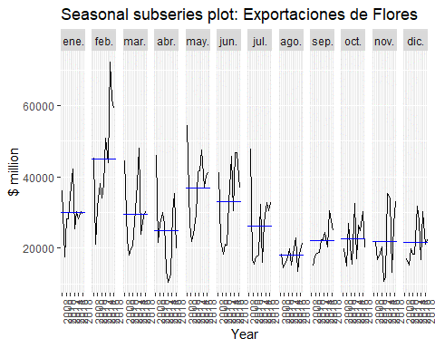

layout: true

---
background-image: url(fig/moses.jpg)
background-size: cover
class: center, center, top

#.large[.fontone[.left[.opaco[¿Analytics?:]]]]

### .center[.large[.fontone[.red[Luces, Data...¡Acción!]]]]

 
 
 
 
 
 
 
 
 
 
 
 

.right[.blue[.extralarge[ .fontone[Zulemma Bazurto Blacio    Becas New Dimensions | 2023]]]]

---
background-image: url(fig/fondolide.jpg)
background-size: cover
class: center, center, top

## .textcenter[.nd[.fontone[  Fotografía para Exhibición de Mujeres en Ciencias]]]

.fontone[.textcenter[.weight[¿QUÉ ES UNA FOTO DE BUENA CALIDAD ?]]]
---
background-image: url(fig/fondolide.jpg)
background-size: cover
class: center, center, top

## .weight[.fontone[.nd[.center[¿Algoritmos en fotografía?]]]]

<ul style="list-style-type: none">
        <li>📸 Evaluar la foto enviada inicialmente.</li> 
         
        <li>📸 Definir tiempo de entrega de la foto nueva </li>
         
        <li>📸 Realizar fotos aprovechando tiempo y recursos  </li>
         
        </ul>

---
background-image: url(fig/equipo.jpg)
background-size: cover
class: center, center, top

---
background-image: url(fig/fondolide.jpg)
background-size: cover
class: center, center, top

## .fontone[.nd[No tiene valor un producto profesional  que no se ajusta a nuestras necesidades y gustos]]

---
background-image: url(https://i.picasion.com/pic92/954ec0a2b5546fb54fcb909e2231d07a.gif)
background-size: cover

---
background-image: url(fig/whole.jpg)
background-size: cover
class: center, center, center

## .fontone[.nd[EL ALGORITMO DE FOTOGRAFÍA FUNCIONANDO EN ANALYTICS]   .black[Definiendo la necesidad]]

<ul style="list-style-type: none">
        <li>🤖️ Dar respuestas a las preguntas del negocio</li> 
         
        <li>🤖️ Analizar datos</li>
         
        <li>🤖️ Aplicación de análisis estadístico</li>
         
        </ul>

---
background-image: url(fig/whole.jpg)
background-size: cover
class: center, center, center

## .textcenter[.nd[.fontone[Implementos del algoritmo de Analytics (inverso)  .black[Ajustando las necesidades del usuario interno]]]]

<ul style="list-style-type: none">
        <li>️ 🕵️📜️ Preguntas con enfoque "data-driven"</li> 
         
        <li> 🤲📑Necesito: Datos de mi negocio</li>
         
        <li> 🔧🚼️️ Herramientas: ajustarlas a la etapa y edad del negocio</li>
         
        </ul>

---
background-image: url(https://i.pinimg.com/originals/13/50/4e/13504e03244492d58a717788ec97ecdf.gif)
background-size: cover

---
background-image: url(fig/chain.jpg)
background-size: cover
class: center, center, center
---
background-image: url(https://i.gifer.com/4YR1.gif)
background-size: cover
---
background-image: url(https://64.media.tumblr.com/0a0ef5f13172c38b094a93f250c906d1/a6315d415d3be52d-3d/s500x750/385e6a092e91ce4a3ba0b879212581aafe0d8fce.gifv)
background-size: cover
---
background-image: url(https://i.makeagif.com/media/5-11-2017/V_svUT.gif)
background-size: cover
---
background-image: url(fig/chain.jpg)
background-size: cover
class: center, center, center
---
background-image: url(fig/team.png)
background-size: cover
class: center, center, center
---
background-image: url(fig/fondolide.jpg)
background-size: cover
class: center, center, top

## .weight[.fontone[.nd[.center[Ciencia de Datos: Su cardinalidad usual]]]]

<ul style="list-style-type: none">
        <li>✔️ Codificar, ¿ en qué lenguaje?</li> 
         
        <li>✔️ ️Estadística, ¿qué metodo usar?</li>
         
        <li>✔️ Machine Learning, ¿ésto es diferente a Estadística e Inteligencia Artificial?</li>
         
        <li>....aún falta el dominio del área de expertiz!! UF!!</li>
        </ul>

---
background-image: url(http://www.liesdamnedlies.com/wp-content/uploads/2018/07/Funny-Unicorn-Wallpaper-Full-HD-Free-Download-Wallpaperxyz.com-28-e1530575544713.jpg)
background-size: cover
---
background-image: url(fig/build.jpg)
background-size: cover
class: center, center, top

---
background-image: url(https://64.media.tumblr.com/tumblr_m59ub2NDLr1r1n5pqo1_500.gifv)
background-size: cover

---
background-image: url(fig/datahr.jpg)
background-size: cover
class: center, center, top

---
background-image: url(fig/fondolide.jpg)
background-size: cover
class: center, center, top

## .textcenter[.nd[.fontone[Motivación: Método de Pronóstico para Exportaciones de Flores de Ecuador a USA]]]

.fontone[.textcenter[.weight[¿DEBEN LOS EXPORTADORES DE FLORES CONTINUAR INVIRTIENDO EN EL MERCADO ESTADOUNIDENSE?]]]
---
background-image: url(fig/fondolide.jpg)
background-size: cover
class: center, center, top
## .textcenter[.nd[.fontone[Analítica descriptiva: ¿estacionalidad?]]]

---
background-image: url(fig/fondolide.jpg)
background-size: cover
class: center, center, top

## .textcenter[.nd[.fontone[Pronosticando las Exportaciones  de Flores de Ecuador a USA para los siguientes  5 años]]]

---
background-image: url(fig/fondolide.jpg)
background-size: cover
class: center, center, top

# .nd[.fontone[¿BUENAS PRÁCTICAS O DESAFÍOS?]]

## ✔️ .fontone[ Generar data limpia, accesible y disponible.]

## ✔️ .fontone[Crear equipos de Ciencia de Datos efectivos.]

## ✔️ .fontone[Educar a las personas sobre lo que los datos pueden hacer.]
---
background-image: url(https://ca-times.brightspotcdn.com/dims4/default/e381cf8/2147483647/strip/true/crop/6720x4480+0+0/resize/1080x720!/quality/90/?url=https%3A%2F%2Fcalifornia-times-brightspot.s3.amazonaws.com%2Feb%2F52%2F5746ecfd420d95cad66a8613438c%2Fla-photos-1staff-462860-me-0929-oakland-baby-raves-cmh-05.JPG)
background-size: cover

# .white[.fontone["Hay que hacer cosas increíblemente no lineales para llegar donde se desea estar"]]

---

background-image: url(https://64.media.tumblr.com/cfc889b37729a964c14e733a1b9acb51/tumblr_n2jz4pKOJC1rrftcdo1_500.gif)
background-size: cover

