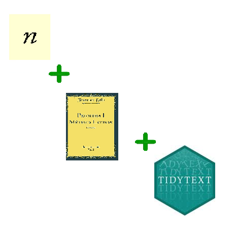
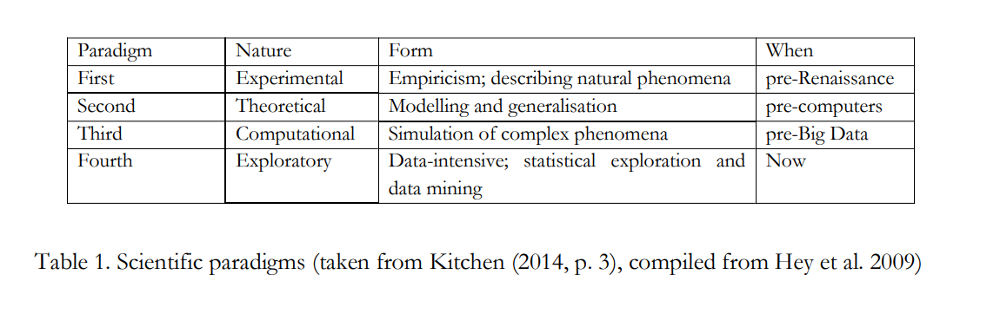

layout: true

---

class: inverse, center, bottom
background-image: url(fig/XXJE_logo.png)
background-size: cover

https://images.unsplash.com/photo-1543286386-713bdd548da4?ixlib=rb-1.2.1&ixid=eyJhcHBfaWQiOjEyMDd9&auto=format&fit=crop&w=1500&q=80
# .espol[¡BIENVENID@S!]

---

background-image: url(fig/matter.jpg)
background-size: cover
class: center, center, top

#.extralarge[.white[Ciencia y data: ¿vasta o basta?]]

.weight[.white[                 .novo[Zulemma Bazurto Blacio]]]
 
.weight[.white[.novo[Octubre 2023]]]
---
background-image: url(https://www.vistazo.com/binrepository/768x598/0c0/768d432/none/12727/QLCN/camila-hogar51312-editar_523552_20220719114547.jpg)
background-size: cover

---

background-image: url(fig/anzuelo2.jpg)
background-size: contain
class: center, center, top

---
## .weight[.fontone[.greenlime[.center[¿Va de Ciencia o va de data?]]]]

<ul style="list-style-type: none">
        <li>✔️ Morfosintaxis: ¿sustantivos? ¿verbos? </li> 
         
        <li>✔️ ️Arreglos: # de espacios disponibles para las letras</li>
         
        <li>✔️ Combinación vs # máxima de vocales en el arreglo</li>
         
        <li>....un poquito de R y métrica</li>
        </ul>

---
background-image: url(https://media.tenor.com/OK-dmx5cqJkAAAAC/dramatic-music.gif)
background-size: contain

---
background-image: url(https://images.unsplash.com/photo-1531822762069-cd72bb624630?ixlib=rb-4.0.3&ixid=MnwxMjA3fDB8MHxwaG90by1wYWdlfHx8fGVufDB8fHx8&auto=format&fit=crop&w=389&q=80)
background-size: cover

---
background-image: url(https://images.unsplash.com/photo-1623074348655-508fc23724e0?ixlib=rb-4.0.3&ixid=MnwxMjA3fDB8MHxwaG90by1wYWdlfHx8fGVufDB8fHx8&auto=format&fit=crop&w=875&q=80)
background-size: cover
---
background-image: url(https://petewarden.files.wordpress.com/2014/06/nobrain.png?w=584&h=432)
background-size: cover

---

background-image: url(https://www.lifesciencesipreview.com/media/image/andreas-berheide-shutterstock-com-1.jpg)
background-size: cover

class: bottom, right
# .white[.fontone["Don't use an sledgehammer to crack a nut"]]

---
background-image: url(https://media.tenor.com/gBHJtNMfw90AAAAM/data-star-trek.gif)
background-size: contain

---
background-image: url(https://www.uxban.com/wp-content/uploads/2019/10/dormitorio_dos_ambientes.jpg)
background-size: contain

# .weight[.fontone[.white[.center[Maximalist  vs Minimalist ]]]]

---
background-image: url(https://images.unsplash.com/photo-1503222646189-eaef09a0b6fa?ixlib=rb-4.0.3&ixid=MnwxMjA3fDB8MHxwaG90by1wYWdlfHx8fGVufDB8fHx8&auto=format&fit=crop&w=876&q=80)
background-size: cover

class: bottom, right
# .white[.fontone["Normal science in a data-intensive paradigm",]]
.white[.fontone[Jules Desai et.al. 2022]]

---
background-color: #32cd32
class: center, center

# .white[.fontone[Implicaciones de la Ciencia agnóstica]]

.aligncenter[]

.white[.fontone[Jules Desai et.al. 2022]]
---
background-image: url(https://img.freepik.com/premium-vector/yellow-chartreuse-green-lime-green-gradient-wallpaper-background_172010-1264.jpg)
background-size: cover

## .weight[.fontone[.white[.center[.textoverline["Black box" problems!]]]]]

.weight[.white[.fontone[Opacidad de los algoritmos
]]]

.weight[.white[.fontone[Ciencia sin teoría]]]

# .right[.fontone[.white[  The paradoxical faces of Data Science]]]
---
background-image: url(fig/algoritmo.jpg)
background-size: cover
class: center, center, top

#.novo[.weight[¿ R O A D L E S S ?]]
---
# .green[.fontone[¿HAY ALGO POR HACER?]]

## ✔️ .fontone[Cinturón blanco]

## ✔️ .fontone[The smear test]

## ✔️ .fontone[Human centered-data science ]

---
background-image: url(fig/desaprende.jpg)
background-size: cover

class: bottom, left

## .novo[.white[.weight[.fontone[D E S A P R E N D E R]]]]
---
background-image: url(https://cdn.apartmenttherapy.info/image/upload/f_auto,q_auto:eco,c_fit,w_730,h_488/k%2Farchive%2Fe00f17b51b459f311bd60dba9f4d3f464a6379cd)
background-size: cover

class: center, center
# .extralarge[.white[.fontone[  La prueba del risotto]]]

---
background-image: url(https://m.media-amazon.com/images/S/pv-target-images/8d66e26c5e34a3d42d4ec897b6ecefcfceb2e47abdb9eb4bcf31e8cfd3812a12.jpg)
background-size: cover

class: bottom, left
# .extralarge[.white[.fontone[  Human-centered ]]]
# .extralarge[.white[.fontone[ Data Science!]]]

---
background-image: url(fig/matter.jpg)
background-size: cover
class: center, center, top

#.extralarge[.white[This is a paradox-talk! ]]

.weight[.white[                 .novo[Ciencia y data: ¿vasta o basta?]]]

